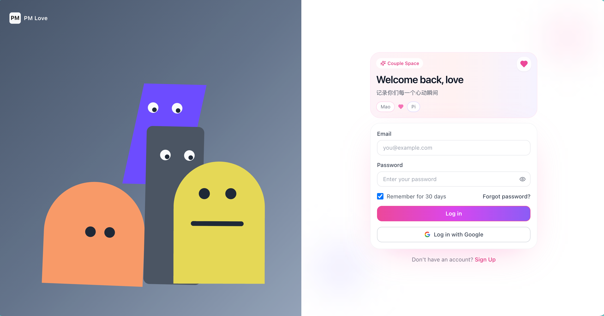

# PM Love

> A private, beautiful, and interactive relationship journal built for two people.

[](https://nextjs.org/)
[](https://react.dev/)
[](https://www.typescriptlang.org/)
[](https://supabase.com/)
[](#)

PM Love 是一个面向情侣的私密空间，聚焦于「记录、回顾、陪伴」。它不仅是一个 CRUD 网站，而是一套有情绪表达的体验：从互动登录页到成功登录庆祝动画，再到时间线、相册、留言板与足迹地图，形成完整的恋爱记录闭环。

## Why This Project

- **体验优先**：登录页采用分栏交互设计，角色会随鼠标注视并在状态变化时有表情反馈。
- **双人私密场景**：全站围绕两人关系记录设计，信息结构天然贴合情侣使用方式。
- **功能闭环完整**：文字、图片、清单、里程碑、地理足迹都可长期沉淀。
- **工程可维护**：Next.js App Router + TypeScript + Supabase，适合持续迭代。

## Features

- **Interactive Login**
  - 左侧 4 个几何角色的眼睛/嘴巴/身体随鼠标联动
  - 登录失败与成功对应不同动画状态
  - 登录成功后 1.5s 庆祝动画再进入主界面
- **Home Dashboard**
  - 恋爱倒计时
  - 功能入口卡片导航
- **Moments（点点滴滴）**
  - 时间线记录
  - 长文本折叠展开
- **Message Board（留言板）**
  - 聊天气泡式留言
  - Enter 快速发送
- **Love List**
  - 恋爱约定清单
  - 完成状态与优先级管理
- **Love Photo**
  - 图片上传/预览/删除
  - Supabase Storage + 数据表联动
- **Love Footprint**
  - 世界/中国/美国地图切换
  - 省州国家足迹标记与统计
- **About Us（关于我们）**
  - 关系故事 + 重要时刻时间轴

## Screenshots

### Login UI



> 想进一步提升 README 吸引力，建议再补 3 张图：
> 首页、留言板、足迹地图。我可以帮你做成统一风格的展示版块（含标题和说明）。

## Tech Stack

- **Framework**: Next.js 15 (App Router)
- **Language**: TypeScript
- **UI**: Tailwind CSS + Lucide React
- **Animation**: Framer Motion
- **Backend**: Supabase (Auth, Postgres, Storage)
- **Map Rendering**: react-simple-maps + d3-geo

## Project Structure

```text
app/
  login/         # 互动登录页
  moments/       # 点点滴滴
  messages/      # 留言板
  list/          # Love List
  photos/        # Love Photo
  footprint/     # Love Footprint
  about/         # 关于我们
components/      # 可复用 UI 组件与业务组件
lib/             # Supabase 客户端等基础能力
hooks/           # 当前用户等业务 hooks
```

## Quick Start

### 1) Install

```bash
npm install
```

### 2) Configure environment

Create `.env.local`:

```env
NEXT_PUBLIC_START_DATE=2021-06-01
NEXT_PUBLIC_PARTNER1_NAME=Mao
NEXT_PUBLIC_PARTNER2_NAME=Pi
NEXT_PUBLIC_SUPABASE_URL=your_supabase_url
NEXT_PUBLIC_SUPABASE_ANON_KEY=your_supabase_anon_key
```

### 3) Run locally

```bash
npm run dev
```

Open:

- Home: `http://localhost:3000/`
- Login: `http://localhost:3000/login`

If port `3000` is occupied, Next.js will auto-switch (for example `3001`).

## NPM Scripts

- `npm run dev` - Start local development server
- `npm run build` - Build for production
- `npm run start` - Start production server
- `npm run lint` - Run lint checks

## Deployment (Vercel)

1. Push this repo to GitHub
2. Import project in Vercel
3. Add environment variables from `.env.local`
4. Deploy

## Roadmap

- [ ] Multi-image showcase section in README
- [ ] Better empty states and onboarding copy
- [ ] Optional PWA support
- [ ] Export memories to PDF/backup package

## Contributing

This project is currently optimized for personal/couple use.  
If you want to adapt it for broader community use, feel free to open an Issue or PR.

---

If this project inspires your own relationship journal, a Star is appreciated.
